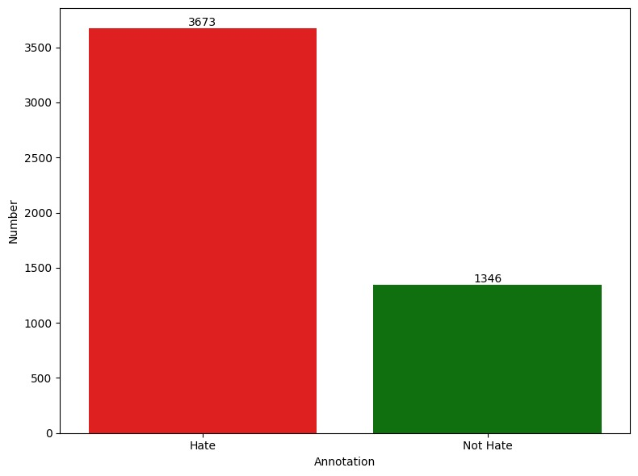
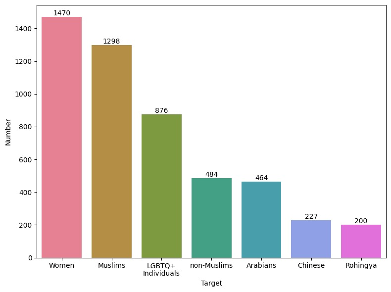

# Indonesian-Multimodal-Hate-Speech-Dataset

Multimodal hate speech dataset consisting of images and texts in Indonesian from Twitter.

## Twitter Crawling

Crawling began from March to May 2024. During the search process, advanced search was performed in the "Photos" tab to ensure only tweets containing images were retrieved using the following operators:
- `""` (Double Quotation Marks): Used to search for exact phrases. Twitter will only display tweets containing the exact words or phrases within the quotation marks.
- `OR`: This logical operator is used to search for one of several terms.
- `lang:` This is a language filter, which narrows search results to tweets in a specific language. In this example, `lang:id` indicates that only tweets written in Indonesian will be shown.
- `AND`: The search results must contain the terms connected by this operator.
- Parentheses `()`: Used to group search terms when using `OR` inside and `AND` outside. This helps ensure that at least one of the terms within the parentheses appears in the search results, and the word following `AND` must be present in all results.

## Keywords

Check `Keywords` folder to see the keywords used in Twitter searches and how to search using those keywords.

## Filtering

Data filtering from the crawl results was performed automatically to identify duplicate data. Duplicates are determined based on the image file names, which are named according to tweet IDs (e.g., if there are 3 images in a single tweet, the filenames are `tweet_id_0`, `tweet_id_1`, `tweet_id_2`). If a duplicate image filename is detected, the program automatically retains only one copy of that data.

In addition to automatic filtering, manual filtering was also conducted by reviewing all the data after automatic filtering. This manual filtering aimed to remove data based on the following criteria:
- Tweets that are not in Indonesian (e.g., Malay, English).
- Scam tweets that use popular keywords to drive traffic but where the information is irrelevant to this research.
- Tweets that do not match the intended target (if they are relevant to a different target, the target simply changed without deletion).

## Dataset

The results of crawling for each keyword are saved in separate files. After all keywords have been searched, all these files are merged into a single dataset file. Each entry will have one text data and one image data. If a tweet contains more than one image, a single tweet text corresponds to multiple entries with different image data. As a result, a total of 5,937 entries were obtained.

The dataset then undergoes automatic and manual filtering processes, resulting in 5,062 entries that are ready for annotation. After annotation is complete, the annotators also identify some tweets that still need to be removed based on the same criteria as during manual filtering. The final dataset consists of 5,019 entries. The details of the dataset are as follows:

## Modeling

Experiments using this dataset were conducted with two modeling methods, including:
1. **Early Fusion**: This method combines text and image features at the input level for integrated analysis.
2. **Late Fusion**: An ensemble classifier using Soft Voting to combine separate text and image model predictions.

The code to perform these experiments can be accessed in this repository.
